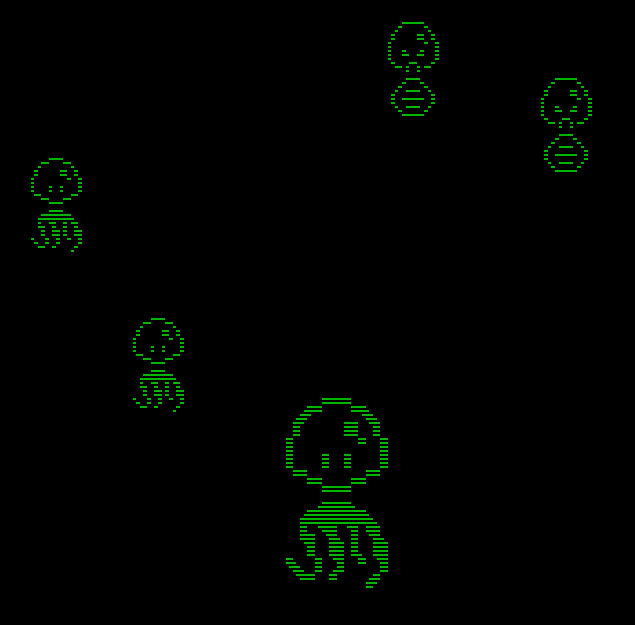
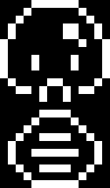
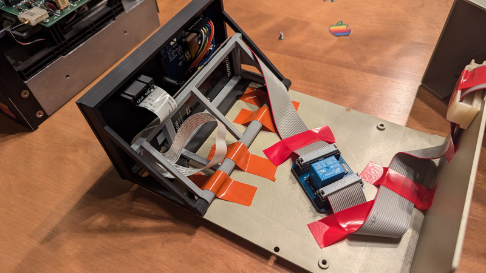
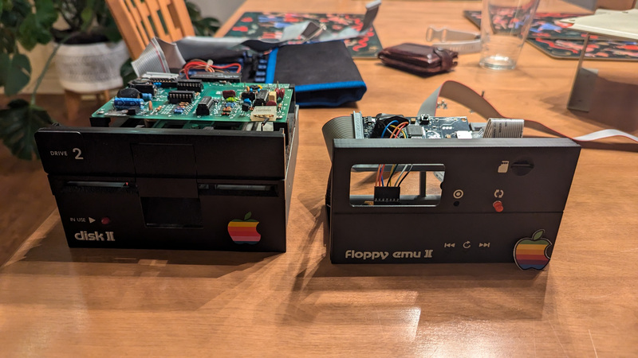
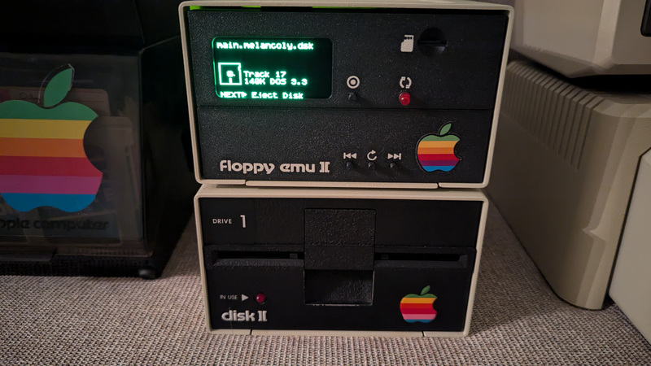

# Apple IIe Graphics & Sound Engine

[](src/main.s)
[](tools)
[]()
[](https://github.com/linappleii/linapple)
[](https://www.brutaldeluxe.fr/products/crossdevtools/merlin/)

> A high-resolution sprite engine, sound synthesizer, and full asset pipeline — written in 6502 assembly for the Apple IIe.



---

## The Experiment

This project started as three questions:

1. **Can the physics math I built for a Python game engine apply to a 1 MHz processor?**
   I had previously written a physics engine in Python for the [Thumby](https://thumby.us) tiny console. The challenge: can those same ideas — sprite movement, bounds checking, coordinate mapping — translate to 6502 assembly running on 40-year-old hardware with no division instruction and 64KB of addressable memory?

2. **Can AI meaningfully assist development on an obscure, barely-documented platform?**
   Apple IIe 6502 assembly is not a language where AI shines out of the box. The toolchain is niche, the memory architecture is non-obvious, and documentation is fragmented across vintage manuals. This project was also a benchmark: where does AI help, where does it fall flat?

3. **Can a modern asset pipeline feed retro hardware?**
   GIMP for sprites. A web MIDI editor for music. Python scripts as the glue. Can modern creative tools generate assets that run on a 1 MHz machine?

The short answer to all three: **yes — with significant effort and the right abstractions.**

---

## What Was Built

- **Hi-res graphics engine** — double-buffered 280×192 rendering with flicker-free page flipping
- **Sprite system** — up to 12 simultaneous sprites of arbitrary size, independently positioned
- **Sound engine** — 1-bit speaker synthesis with precise cycle-counted timing
- **MIDI-to-assembly converter** — compose modern music, run it on Apple II hardware
- **Bitmap-to-assembly converter** — design sprites in GIMP, render them in 6502
- **CI/CD pipeline** — VS Code task → Merlin32 assembler → bootable `.dsk` image → LinApple emulator → real hardware via floppy emulator

---

## AI as Co-Pilot

AI was genuinely useful — but not everywhere.

**Where it helped:**
- Designing the coordinate-to-memory lookup table architecture for the graphics engine
- Structuring the sound engine timing model (cycle-accurate pitch encoding)
- Writing and debugging the Python asset pipeline tools (`cbmp2asm.py`, `midi2asm.py`)
- Explaining Apple II ROM routines and memory-mapped I/O quirks

**Where it hit limits:**
- Generating correct 6502 assembly from scratch — too much hallucination on non-standard opcodes and Apple II-specific memory layout
- Anything requiring real hardware validation — emulator behavior vs. real chip behavior had to be debugged manually

The honest summary: **AI was most useful as a tools builder and architecture advisor, not as an assembly programmer.** The engine itself was hand-written and hand-debugged.

---

## Engine Architecture

### Graphics Engine (`src/graph/graph.engine.s`)

The Apple IIe hi-res screen is 280×192 pixels packed at 7 bits per byte (the 8th bit controls color fringing). Memory is non-linear — Y addresses jump around in a pattern that cannot be calculated cheaply at 1 MHz.

**Solution: full denormalized lookup tables.**

```
DataMemHighBytePage1/Page2   ; Y → high byte of screen address (per display page)
DataMemLowByte               ; Y → low byte offset
XMappingByte                 ; X → byte column (0–39)
XMappingBitOffset            ; X → bit offset within byte (0–6)
```

No division. No multiplication. Every coordinate lookup is two table reads and a shift. This is the only way to move multiple sprites in real time on a 1 MHz CPU.

**Double buffering** switches between Page 1 (`$2000–$3FFF`) and Page 2 (`$4000–$5FFF`). The visible page is never written to — the engine draws to the back buffer, then flips.

### Sprite System (`src/main.s`)

Sprites are 6-byte structures: a pointer to shape data plus two coordinate pairs (one per display page, required by the double-buffer model). Shape data is stored in 7-bits-per-byte format, bottom-to-top, matching the drawing direction of the engine.

- Max sprites: 12 (configurable via `MAX_SPRITE`)
- Max sprite size: 32px wide × 48px tall
- Shape data lives at `$A000`, coordinate tables at `$9000`/`$9100`

### Sound Engine (`src/sound/sound.engine.s`)

The Apple IIe has a 1-bit speaker toggled by reading `$C030`. Pitch = toggle frequency. Duration = number of toggles. The trick: every code path through `PlayTone` must consume the **exact same number of CPU cycles** regardless of pitch, otherwise timing drifts and notes sound wrong.

```asm
PlayTone  ; X = pitch divider (higher value = lower frequency)
          ; Y = duration counter
```

Pitch encoding is inverted by design — a higher byte value means a slower toggle rate, which means a lower audible frequency.

Pre-built sound effects (`src/sound/sound.library.s`): motor hum, reward chime, ice chirp, alarm, laser, machine gun, falling tone, bubble glissando.

### Controller (`src/controller.engine.s`)

Keyboard (`KYBD`/`STROBE`) and joystick (`PREAD`) via Apple ROM routines. Analog paddle axis reads via ADC.

---

## Asset Pipeline

### Sprites: GIMP → Assembly

Design sprites in GIMP as 1-bit black-and-white images at native Apple II resolution. Export as a C header file (GIMP built-in export). Run the converter:

```bash
python3 tools/graph/cbmp2asm.py tools/graph/c/Squid.c
```

Output is a hex data block ready to paste into your assembly source — width, height, and pixel rows encoded in 7-bits-per-byte format, bottom-to-top.

The engine supports sprites up to 2048 pixels wide via multi-table indexing. Any aspect ratio works.

| Sprite | Source |
|--------|--------|
|  | `tools/graph/gimp/Snake.xcf` |

### Music: MIDI → Assembly

Compose your track in any MIDI editor. This project used [Signal MIDI](https://signalmidi.app) — a browser-based MIDI editor — to compose the game themes. Convert with:

```bash
python3 tools/sound/midi2asm.py tools/sound/SquidTheme.mid
```

Output: a 2-byte-per-note encoded sequence (1 byte pitch, 1 byte duration) at up to 1/64 quarter-note resolution, supporting up to 128 notes per track. Tempo is extracted from the MIDI file automatically.

Tracks included:
- `tools/sound/SquidTheme.mid` — main game theme
- `tools/sound/SquidTheme2.mid` — short punk variant
- `tools/sound/SquidMelancoly.mid` — melancholy variant

---

## Build & Run

### Dependencies

| Tool | Purpose |
|------|---------|
| [Merlin32](https://www.brutaldeluxe.fr/products/crossdevtools/merlin/) | 6502 macro assembler |
| Java (JRE) | Apple Commander (`build/ac.jar`) — creates bootable `.dsk` images |
| [LinApple](https://github.com/linappleii/linapple) | Apple II emulator for local testing |
| GIMP | Sprite design + C header export |
| Python 3 | Asset pipeline tools |

### Compile & Run

The full pipeline is wired as a VS Code task (`.vscode/tasks.json`). Manually:

```bash
# 1. Assemble
merlin32 src/main.s

# 2. Move binary
mv src/main build/

# 3. Package into bootable disk
cp build/dos33.autoboot.dsk build/main.dsk
java -jar build/ac.jar -p build/main.dsk main B 0x6000 < build/main

# 4. Run in emulator
linapple --d1 build/main.dsk -b
```

### Booting

| Disk | Boot method |
|------|-------------|
| `dos33.autoboot.dsk` | Auto-runs on insert — no interaction needed |
| `dos33.dsk` | Boot to DOS prompt, then type `BRUN MAIN` |

---

## Hardware

The engine runs on real Apple IIe hardware via a **Floppy Emu II** — a device that appears to the Apple II as a standard 5.25" Disk II drive but reads `.dsk` images from a microSD card. No floppy disks required.

Hardware sourced from [EmuShop](https://www.emustore.net). The CI/CD pipeline ends here: compile in VS Code, copy `.dsk` to microSD, boot on real hardware.

| | | |
|:---:|:---:|:---:|
|  |  |  |
| Internal wiring & 3D-printed chassis | Floppy Emu II beside the original Disk II | Live — loading `main.melancoly.dsk` |

---

## ROM Gallery

Pre-built disk images in `build/` — each captures a different engine experiment:

| File | Description |
|------|-------------|
| `main.dsk` | Current build — 7 sprites, sound, full engine |
| `main.horizontal.dsk` | Horizontal movement proof of concept |
| `main.vertical.dsk` | Vertical movement proof of concept |
| `Dropping2aliens.dsk` | 2-sprite drop test |
| `Dropping7aliens.dsk` | 7-sprite stress test |
| `Dropping7aliensSound.dsk` | 7 sprites + synchronized sound |
| `fast.dsk` / `slow.dsk` | Frame rate comparison builds |

---

## WIP & Known Limits

The physics engine is partially implemented. Vertical movement is fast (simple Y increment). Horizontal movement is slow — each pixel shift requires bit-shifting sprite data across byte boundaries, and a full lookup table for all sprite widths and X positions would consume more memory than is practical. This is where the project is currently paused.

Remaining optimization targets (see `todo`):
- `DrawShape`: add bit-shift support for sub-byte X positioning
- `DrawShape`: sprite masking and double-size rendering
- `SetSpritePtr`: address calculation optimization
- Physics: off-screen sprite detection

---

## Dependencies Summary

```
merlin32        → assemble 6502 source to binary
java + ac.jar   → package binary into bootable DOS 3.3 disk image
linapple        → Apple II emulator (testing without hardware)
gimp            → sprite design, exports to C header
python3         → cbmp2asm.py (sprites), midi2asm.py (music)
```
